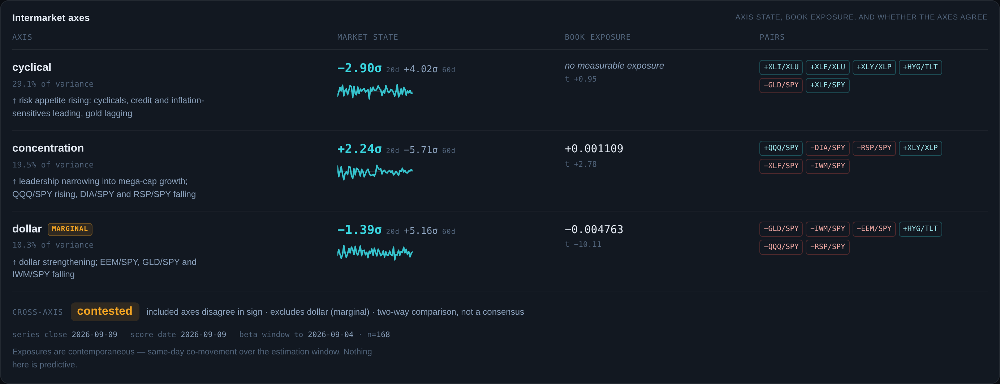
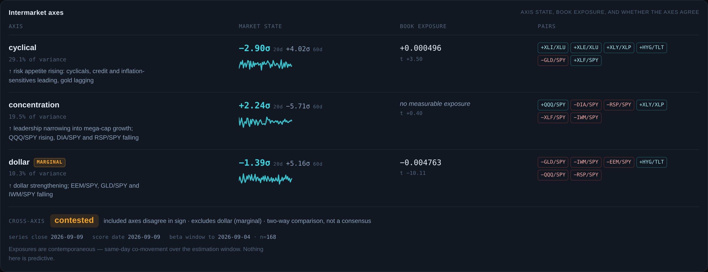
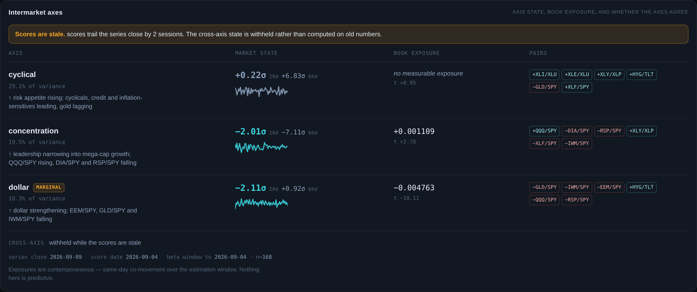

# A2 — the intermarket axis panel

**2026-09-10**, project `vdmojjszvvcithuxwexx`. Nexus → Regime tab.

Three things and no more: where each axis sits, what the book's measured
exposure to it is, and whether the axes agree. No regime label, no composite
score, nothing predictive.



## Live state, 2026-09-09

| axis | 20d | 60d | book exposure | t |
|---|---:|---:|---|---:|
| cyclical (29.1%) | −2.90σ | +4.02σ | **no measurable exposure** | +0.95 |
| concentration (19.5%) | +2.24σ | −5.71σ | +0.001109 | +2.78 |
| dollar (10.3%) · **marginal** | −1.39σ | +5.16σ | −0.004763 | −10.11 |

**Cross-axis state: `contested`.** The two non-marginal axes disagree in sign —
cyclical is −2.90σ over 20 sessions while concentration is +2.24σ, and both are
far past the 0.5σ threshold. `dollar` is excluded because it is marginal, and
the panel says so on its face. With two axes included this is a two-way
comparison, which the panel also says: it is not a consensus and must not be
read as one.

The disagreement is not resolved and the scores are not averaged. Risk appetite
is falling while leadership narrows into mega-cap growth; those are two
different statements about the same tape and collapsing them into one number
would destroy the only information the state carries.

## The one rule (§2), and that it is data-driven

`cyclical` is the largest axis by variance explained and the book has **no
measurable exposure to it** (t = 0.95). The cell renders that sentence, never
the number.

This is not a carve-out. The rule reads the `significant` flag, and the beta is
**absent from the row shape** when the flag is false — a renderer cannot print
a number it was never handed. That is the same construction as
`nexusReturnBasis.js`, where the substitution is impossible to write rather
than discouraged, and it is asserted:

```js
assert.equal('beta' in row.exposure, false);
```

### Acceptance 3, proven twice

**In the database** (`a2_acceptance_3_significance_flip_rolled_back`), a scratch
estimate set flipping `cyclical` on and `concentration` off:

```
pass  concentration  significant=f     t=0.40   beta=0.001109 (unchanged)
pass  cyclical       significant=t     t=3.50   beta=0.000496 (unchanged)
pass  dollar         significant=t     t=-10.11 beta=-0.004763 (unchanged)
pass  prior estimate set still present beneath it (5 rows)
```

**In the panel**, the same flip rendered — cyclical now shows `+0.000496`,
concentration shows "no measurable exposure". No code changed between the two
screenshots:



**`significant` cannot be flipped on its own.** The database refused the first
attempt:

```
ERROR: new row violates check constraint "bfb_significant_ck"
CHECK (significant = (abs(t_stat) > 2))
```

The flag is bound to its own evidence by a CHECK, so a scratch set has to move
the t-stat too. That is a better property than the spec assumes: the panel
cannot be shown a flag that disagrees with the statistic underneath it, because
the database will not store one.

**Deviation, stated so it can be overruled.** The spec says to append a scratch
set and revert by reading the prior set. Appending fabricated estimates to an
append-only history leaves them there permanently, and this codebase already
records what a fabricated row in a history costs. The flip was forced inside a
transaction that **rolls back** instead — the same discipline as the C5 and
verdict-preflight tests. Verified after: 10 rows, 2 sets, latest still
`concentration=true, cyclical=false, dollar=true`.

## Everything renders from the database (§1)

There is no axis list, pair list, sign, label or per-axis threshold in the
component. Ordering is `pc_rank` ascending, straight from the query.

`alpha` and `market` live in `book_factor_betas` but are **not rows of
`factor_axes`**, so the join drops them without naming them — the exclusion is
structural rather than a deny-list. Asserted.

Two tests use axis keys that do not exist in the live database (`synthetic`,
`fourth`), so anything hardcoding the real three fails there. A fourth axis
appears with no code change.

`book_factor_betas` now holds two estimate sets; the panel takes the newest by
`estimated_at` **whole**, never row by row, so a row can never be paired with
another vintage's window. `window_end` and `n_obs` are surfaced.

## Direction and signs (§3)

Every row carries `positive_means` on its face. Direction is never inferred
from the key — `concentration` reads backwards from its raw component, and the
row states "leadership narrowing into mega-cap growth" rather than leaving a
reader to guess from the word.

Pair chips carry the loading's sign: `−GLD/SPY` under cyclical, so the row
cannot be read as claiming gold rises with credit.

`dollar` carries a visible `MARGINAL` badge. It cleared the Marchenko-Pastur
edge by little and carries the second-largest exposure in the book; that
combination belongs on the face of the panel, not in a footnote.

## Dispersion (§4) — and a caveat on the threshold

A state, never a score. Computed only over `marginal = false` axes. Fewer than
two of those renders "insufficient axes" rather than a state. All four outcomes
are reachable by fixture and asserted.

**The caveat, which the spec could not have known.** `score_20d` is a **rolling
20-session sum** of the daily axis score (see `atlas_refresh_factor_scores`),
not a sigma-scaled level:

| axis | mean \|daily\| | mean \|20d\| |
|---|---:|---:|
| cyclical | 1.23 | 5.85 |
| concentration | 1.16 | 5.13 |
| dollar | 0.79 | 3.31 |

So 0.5 sits at roughly a tenth of a typical reading. Backtested over the 4,116
sessions carrying both non-marginal axes, the spec's thresholds give:

| state | days | share |
|---|---:|---:|
| aligned | 2,175 | 52.8% |
| contested | 1,919 | 46.6% |
| **quiet** | **22** | **0.53%** |

`quiet` is reachable but effectively a null category. The threshold is applied
exactly as specified and lives as **one named constant** (`QUIET_SIGMA`) read in
a single place, so re-deciding it is a one-line change. Flagging, not
redesigning — the number is yours.

## Vintage and staleness (§5)

Three dates, all visible: series close `2026-09-09`, score date `2026-09-09`,
beta window to `2026-09-04` with `n=168`.

Lag is counted in **trading sessions off SPY's own bars**, never calendar days —
a Friday score against a Tuesday close is one session, not four. An unplaceable
score date counts as stale rather than current.

Holding the score date back two sessions raises the banner and **suppresses the
dispersion state**:



The panel states once, not per row, that exposures are contemporaneous.

## The read block (§6) — built, shipped off

Behind `atlas.regime.read.v1`, **default off**, and off when storage throws — a
read that appears because `localStorage` threw is not "default off". Zero
`.na-read` nodes render on a clean environment; asserted in the live screenshot
check and in tests.

Constraints all asserted: an unmeasured axis contributes "no measurable exposure
to the axis" and never receives an interpretation of its beta (the test asserts
the beta's digits do not appear in the line); a marginal axis carries its
qualifier; a contested state says it is not established; a quiet unmeasured axis
says there is nothing to read there; the derivation line is fixed.

The 2026-09-09 mockup's read is superseded and was not used.

## Acceptance

| # | | evidence |
|---|---|---|
| 1 | three rows, no axis list in code | tests use `synthetic`/`fourth`; ordering is `pc_rank` from the query |
| 2 | cyclical "no measurable exposure"; the other two render values | screenshot |
| 3 | flip is data-driven | rolled-back DB flip 4/4 + flip screenshot, no code edit |
| 4 | `positive_means` on every row; signed loadings | screenshot, tests |
| 5 | `dollar` marginal qualifier | screenshot |
| 6 | dispersion over non-marginal only, all states reachable | 7 tests |
| 7 | three dates visible; stale banner proven | screenshot + stale screenshot |
| 8 | read block present, flag off by default | 0 nodes rendered; tests |

**30 new tests, 175/175 across the whole Nexus suite. `npm run build` clean.**

## How the screenshots were taken

The headless browser in this container **cannot reach Supabase** — the agent
relay drops the tunnel mid-exchange (`ws_closed_mid_exchange`, code 1006), and
a direct `fetch` from the page fails after ~12s. The flagship shell also cannot
start under plain `vite`, because it needs the `/api/*` routes only `vercel dev`
serves. Neither is caused by A2.

So the rows were read server-side from the live database and replayed at the
transport layer: `window.fetch` returns them for `/rest/v1/*`. **The real
supabase-js client, the real query builders and the real component all still
run** — only the socket is different, and every value on screen is the live
database's as of 2026-09-09. What is *not* proven end-to-end in-browser is the
network read itself. The harness was deleted; nothing of it is committed.

## Not done

- The read block stays off. Roadmap v2 gates it on one month of the panel live.
- **A3 not started.**
- The panel is mounted below Book fit on the Regime tab and does not touch the
  existing macro classification above it. That surface asserts a regime label;
  this one deliberately does not, and the two are kept visually separate.
