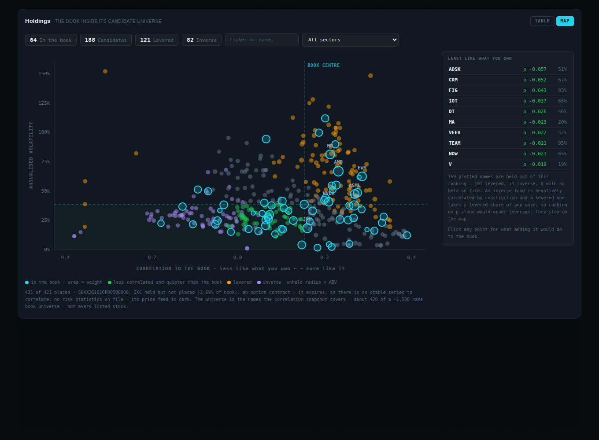
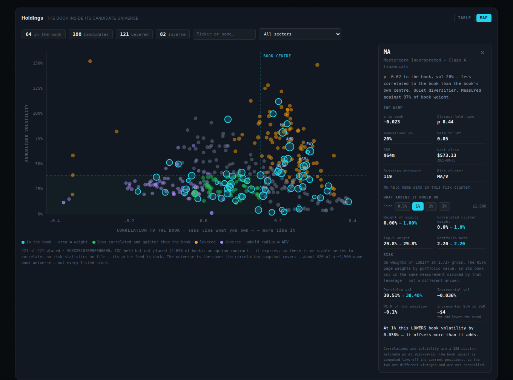

# G-3 · The book universe map

*2026-09-17. `mv_book_candidate_map`, `nexusBookMapCompute.js`, `NexusBookMap.js`.*

A toggle on the holdings table. **TABLE** is what you own; **MAP** is what you
own sitting inside the set of things you could own instead, with a drawer that
runs the real book-impact engine on any point you click.



## 1. The axes are the whole design

The binding constraint is that **both axes must be computable for a name
whether or not it is held.** Plot held names on one measure and candidates on
another and the chart is two experiments sharing a frame — the mixed-basis
failure this codebase has caught repeatedly under other names.

| | measure | reading |
|---|---|---|
| **x** | weight-weighted mean `correlation_simple` to the current book | left = differentiated, right = more of what you own |
| **y** | annualised volatility, same snapshot and same 120-session window | |

**The name's own weight is excluded and the remainder renormalised.** A
position's correlation with itself is 1 and says nothing about how
differentiated it is from the *rest* of what you own; including it would drag
every held name to the right by its own weight and make the book look
systematically less diversifying than it is.

`vol_annual` comes from `universe_risk_stats` at the **same `as_of_date` and
the same window** the correlations were estimated on — Σ = D R D is coherent
only when D and R span the same observations (B4).

Quadrants are anchored on the **book's own weighted centroid**, not on zero.
"Diversifying" is a claim relative to what you hold, and against a book whose
centre sits at ρ 0.16 a candidate at ρ 0.10 is a diversifier even though it is
positively correlated in absolute terms.

## 2. The finding: the naive ranking is a leverage screen

The first build was self-proving in both directions, which is the reason to
look at real data before shipping a ranking.

- **Most correlated to the book**: ACWI, VXUS, VTI, VEA, SPY — total-market
  funds. Exactly right, and a good sign the arithmetic and the sign are sound.
- **Least correlated**: SPDN, SH, RWM, PSQ, QID — **every one an inverse ETF**.

The second list is arithmetically correct and practically a trap. An inverse
fund carries negative ρ **by construction**, not by being a differentiated bet,
and a levered one takes a levered share of any move. Ranking "what would
diversify this book" on ρ alone grades leverage and direction — which is
exactly why `regret_vs_best_pct` is display-only and never a sort key.

Measured on this universe: `beta_spy` runs **−8.81 to +8.65**; 82 of 421 names
carry a negative beta, 95 sit above β 1.8, and 18 are **both** inverse and in
the diversifying half of the map. **198 of 423 rows — 47% — are inverse or
levered.**

**Gated on measured beta, never on a name.** A deny-list of "3X" / "Ultra" /
"Bear" / "Short" would miss the next one and flag an innocent fund, the same
argument that gates `switch_to_cluster_leader` on measured volatility. `SH` at
β −0.988 is genuinely inverse, **not** levered, and a defensible hedge; `QID`
at −3.02 is both. The two facts are published as two columns because they are
two facts.

Both classes are **plotted and badged**; what they are excluded from is the
*ranking*, and the count and the reason are printed rather than the names
quietly vanishing. With leverage held out, the ranking becomes useful:

```
ADSK  ρ −0.058   51%      MA    ρ −0.023   20%
CRM   ρ −0.053   67%      VEEV  ρ −0.025   52%
FIG   ρ −0.044   83%      TEAM  ρ −0.030   95%
```

Enterprise software and payments against a semis / energy / global book. MA at
ρ −0.023 and 20% vol is a real suggestion; `SH` was not.

## 3. Two absences, named apart

`SOXX261016P00500000` has no row in the matrix because it is an **option
contract** — it expires, so there is no stable series to correlate and there
never will be. `IXC` has no row because its **feed is dark**. The first is not
measurable by construction; the second is a gap that could close. Collapsing
them into one "absent" reads as a data problem when half of it is a category,
so `absence_reason` keeps them apart and the map prints both sentences.

**A held name absent from the matrix still gets a row**, and the map states how
much of the book it is not showing (2.69% today). Dropping it would make the map
silently show a smaller book than the one you own.

`measured_weight_pct` is published beside every ρ. The matrix covers ~420 of a
~1,500-name universe and inclusion is not guaranteed for held names, so a ρ
taken over 93% of book weight must not read like one taken over all of it.

## 4. The drawer runs the real engine, not a second copy of it



Clicking a point calls **`computeBookImpact`** — the same function Trade's
Pane B renders, with the same inputs — over `loadBook()` and
`loadRiskLayer({ symbols: book ∪ candidate })`. A second implementation of that
arithmetic is how two surfaces start disagreeing about your risk.

On the live book, MA at 1%:

```
Weight of equity            0.00% → 1.00%
Correlated cluster weight    0.0% → 1.0%
Top-5 weight                29.8% → 29.8%
Portfolio beta               2.20 → 2.20
Portfolio vol              30.51% → 30.48%
Incremental vol            −0.036%
Incremental 95% 1d VaR     −$4     the add lowers the bound
```

> At 1% this LOWERS book volatility by 0.036% — it offsets more than it adds.

**The risk block shares Pane B's coverage gate**, because it is the same matrix.
A vol built with missing pairs filled at ρ 0 is the diversified-away floor, not
this book.

### The basis had to be named

That 30.51% sits beside `vw_book_mctr`'s **19.37%** on the Risk page, and a
reader has no way to tell that those are the same book. They are:
`computeBookImpact` weights by **equity** (its §4.1 rule), `vw_book_mctr`
weights by **portfolio value**, and this book runs at **1.73× gross leverage**.

```
17.61%  ×  1.712  =  30.15%     against the 30.51% the panel shows
```

Reconciled to within the three extra symbols in the check. So the panel states
its basis and the leverage, and says the Risk page's figure is *the same
measurement divided by that leverage, not a different answer*. Reconciling them
silently would be the mixed-basis failure; leaving them unlabelled would be
worse.

## 5. Three display defects the build could not see

Found by rendering and measuring, not by inspection — the lesson F-5 and F-3
already recorded.

1. **The header layout regressed.** `.nf-card-h` is `justify-content:
   space-between`; adding the TABLE/MAP toggle as a third child let
   `margin-left: auto` take the free space and left "Holdings" touching its
   subtitle. Fixed with a **minimum** `gap`, which is a no-op for the two-child
   cards and therefore moves nothing else.
2. **The sort key was rendered at a precision that could not express the
   sort.** The ranked list sorts on ρ and displayed 2dp, so five consecutive
   rows read `ρ -0.02` and the ordering looked arbitrary. 3dp.
3. **Thirty labels in the dense centre.** The 1.5%-weight label threshold put
   30 of the book's names on the plot and they overlapped into noise. At 2.5%
   it is seven.

Plus two formatting faults in the drawer: a mixed ASCII/U+2212 minus inside one
panel, and `money()` taking `Math.abs`, which printed an incremental VaR of
**−$4 as $4** — the opposite claim, on the one number whose sign is the point.

## 6. A real defect the harness found

The replay harness did not implement `Range`, so `fetchPairsPaged` never saw a
short page and **spun forever**. The harness was wrong — supabase-js sends
`offset`/`limit` as URL params, not a `Range` header — but the production loop
was `for (;;)` with no bound, so a server that ever stopped honouring the
parameters would hang the browser. **A hang is the one failure that reports
nothing at all.** `MAX_PAGES = 64` now caps it and logs at error level; the
guard fired in the harness at 145,792 rows and said so.

Three pages is the real cost of the book's 2,016 pairs, so the cap is far past
any genuine request.

## 7. Performance

`mv_book_candidate_map` is a **materialized** view refreshed CONCURRENTLY by the
existing 10-minute `refresh_nexus_holdings()`, after the two matviews the
flagship already reads. Its weights come from `vw_positions_current`, which
moves every five minutes; refreshing it anywhere else would let the map's book
drift from the holdings table behind the same toggle.

The plain view was measured first, and the result is worth recording:

| | |
|---|---|
| plain view, before | **2,928 ms** — on the 3,000 ms anon ceiling |
| after `VACUUM (ANALYZE) account_snapshots` | **586 ms**, *no query change at all* |
| matview, anon over the wire (5 runs) | 0.48 – **1.35 s** worst |

`account_snapshots` showed **Heap Fetches: 9,680** on an "Index Only Scan" — the
stale visibility map the 2026-08-23 entry says to check before rewriting
anything, flagged again on 2026-09-15 and still not vacuumed. That vacuum helps
**every** reader of `vw_positions_current`, which is most of the platform.

Two growth-linked nodes remain inside `vw_positions_current` and are **flagged,
not fixed** — they belong to shared infrastructure, not to this unit:
a `Seq Scan on positions` for `max(as_of_date)` (10,493 rows, +66/day) and the
`account_snapshots` aggregate (47,210 rows, +288/day). *A seq scan over an
append-only table is a clock, not a constant.*

## 8. Verification

- **383 tests pass**, 18 of them new; `vite build` clean.
- The compute module's fixture **mirrors the matview's row shape, flags
  included**, because `is_inverse` / `is_levered` are the database's
  classification and the surface must not carry a second copy. A test asserts
  the flags are *read* and never re-derived in JS, using a row whose flag
  contradicts its own beta.
- The naive ranking is asserted **explicitly** — the test shows it would return
  `SH`, `QID` first — so a regression that drops the leverage gate fails on the
  behaviour rather than on a flag.
- All three migrations were checked against `supabase_migrations.schema_migrations`:
  every file **hashes identically** to the statement the database actually ran.
  The two prior file/database divergences in this codebase were found after the
  fact; this one was checked before the commit.
