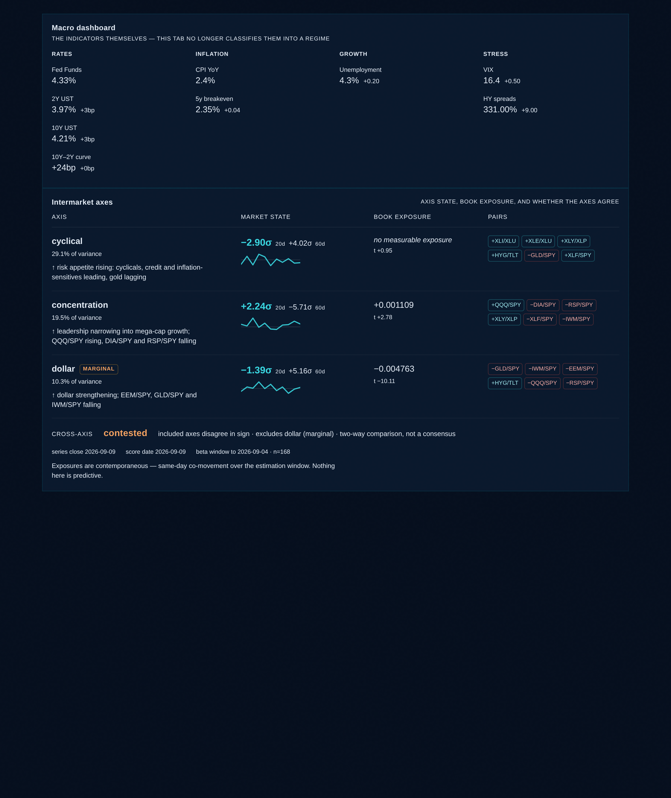

# Phase D — retiring the Growth × Inflation quadrant

**2026-09-10.** Master Build Spec §3. D1 inventory, D2 removal, D3 dependents.

---

## What was retired

The live classification from `api/macro.js` · `classifyRegime()`: two series
(UNRATE, CPI), four hardcoded branches, and a `confidence` that was a literal
constant per branch — rendered on the tab as *"confidence 70%"*.

Superseded by `factor_axes` / `factor_axis_scores` / `book_factor_betas`, which
are derived from the price series and report significance rather than asserting
a label.

## Two objects share these names — they are not the same thing

| | what it is | retired? |
|---|---|---|
| `regime.label` from `/api/macro` | the live 2×2 classification | **yes** |
| `market_regime_windows` | 5 hand-authored **dated windows** | **no** |

`market_regime_windows`' second row is **"Tariff Shock"**, which is not a
quadrant at all. It is a period labelling used by the Regime Slicer, `risk-v2`
and `api/trade-sync`, all of which keep working. Its table comment now says so,
because the overlapping names invite exactly this conflation.

**No table was dropped and no label deleted.** In fact no table held the retired
object: the classification was computed per request and never persisted.

## D1 inventory — consumers of the live label

| # | Site | Use | Disposition |
|---|---|---|---|
| 1 | `nexus/NexusRegime.js` | 2×2 SVG, verdict header, Book fit, regime read | **removed** |
| 2 | `nexus/nexusRegimeCompute.js` | `regimeQuadrant`, `bookRegimeFit`, `regimeRead` | **removed** |
| 3 | `nexus/NexusTheme.js` | rotation banner, `rotationCall` | D3 — reported |
| 4 | `nexus/nexusLiveCompute.js:732` | flagship windshield tile | D3 — reported |
| 5 | `macro-regime.js` (`RegimePanel`) | a second full quadrant panel | D3 — reported |
| 6 | `macro-dashboard.js`, `market-watch.js` | render #5; print the label | D3 — reported |
| 7 | `pcm-optimizer.js` | label → 5-factor tilt + sector table | **disabled, visibly** |

**Excluded as false positives.** `thesisGate.js` / `perf-panel-verdicts.js`
("quadrant" = thesis conviction grid); `quant-signals.js` (RSI vs Z-score
scatter); `risk-v2.js` (**volatility** regime, ELEVATED/COMPRESSED);
`macro_regime_fit` in ~10 migrations (an alias of per-holding `macro_signal`).
`public/js/*` and `dist/*` are stale copies — `index.html` loads only
`/src/main.jsx`.

**Dead code found in passing.** `src/lib/trade/families.js:363` regex-tests the
label against `/risk[- ]?on|expansion|recovery/i`. None of the four labels match
either branch, so it has always fallen through to neutral.

## D2 — the regime tab

The spec's D2 text said "delete the quadrant component and its route". That
under-scopes its own acceptance criterion 5 (*nothing on the regime tab asserts
a single regime label*): three further blocks took `regime.label` as an input.
The rule applied, and confirmed by the product owner, is **if a block takes
`regime.label` as an input, it goes** — the matrix, the verdict header, Book fit
and the regime read.

`bookRegimeFit` is **not** repointed at the axes. It scored the book's sector
tilt against a table of what each label was *said* to reward — an authored
claim. The axis layer measures exposure and reports significance. Substituting
one for the other keeps the shape of the old answer and changes what it means.

One improvement taken while there: the axis panel no longer sits behind the
macro feed. It self-fetches, so a dead `/api/macro` cannot take the measured
exposures down with it.



## D3 — PCM, disabled visibly

PCM is the one consumer that is **not a display**. The label set a five-factor
tilt vector (`mom/quality/lowvol/value/growth`) and a per-regime sector table
supplied **45% of every position's regime score**. A retired classification was
moving allocations.

It is disabled rather than translated. There is no honest mapping from three
intermarket axes to a Growth/Quality/Momentum/Value/LowVol tilt, and the
specific reason is sharper than a general one: **`cyclical` is the only
plausible bridge and the book carries no measurable exposure to it (t = 0.95).**
A translation would condition a live allocation on an exposure the data says is
not there.

`REGIME_CONDITIONING` carries the reason to the surface and both PCM panels
render it. **A neutral tilt vector nobody knows is a default reads like a
considered prior** — the same failure class as an insignificant beta rendering
as a number.

- The sector component is **zero, not renormalised**. Rescaling the remaining
  55% to full weight would present a narrower measurement at its old confidence.
- The **curve-inversion and HY-spread overlays are kept**. They are observed
  market data, were never part of the quadrant, and score rows now carry
  `basis: 'credit_curve_overlay_only'` so nothing can read them as a regime call.

### Held item

| Item | Unblocks when |
|---|---|
| PCM regime conditioning | A style-factor exposure model exists — the book regressed against Growth/Quality/Momentum/Value/LowVol, with per-factor significance reported on the same terms as `book_factor_betas`. Until then PCM runs unconditioned, visibly. |

Do not attempt a partial restoration off the existing axes.

## Acceptance

| # | Criterion | Status |
|---|---|---|
| 1 | D1 inventory reported before removal | met |
| 2 | Quadrant absent from the regime tab; screenshot | met — DOM scan below |
| 3 | No table dropped, no label deleted; retirement recorded | met |
| 4 | Every D1 consumer migrated or reported as blocked | met — #7 disabled, #3–#6 reported |
| 5 | Nothing on the regime tab asserts a single regime label | met |

Banned-token scan of the **rendered DOM**, not the source:

```
absent   Goldilocks     absent   quadrant
absent   Reflation      absent   Book fit
absent   Stagflation    absent   confidence
absent   Deflation      absent   The regime read
svg count: 3   (the three axis sparklines; the quadrant SVG is gone)
```

171/171 tests, `npm run build` clean.

**How the screenshot was taken.** The headless browser in this container cannot
reach Supabase (recorded in `CLAUDE.md`), and the flagship shell needs the
`/api/*` routes only `vercel dev` serves. So live rows were read server-side and
replayed at the `window.fetch` layer: the real supabase-js client, its query
builders and the real components all run, and every value on screen is the live
database's. What is **not** proven end-to-end in-browser is the network read.
The score series is trimmed to the most recent 12 sessions, so the sparklines
are shorter than in production. The harness was deleted; nothing of it is
committed.
